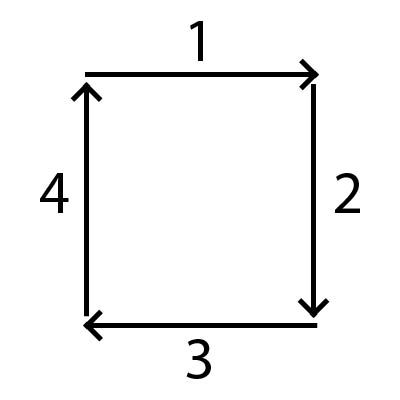

# Code Challenge - Scaling Umbrella

### Problem:

Create a function that returns the array elements arranged from outermost elements to the middle element, traveling clockwise.

### Solution:

- written in javascript.

This solution includes four steps.



Step 1:
Just move the first array into the result.

Step 2:
Iterate the remaining arrays from top to bottom. Move the last element of the arrays into the result.

Step 3:
Move the last array in reverse into the result.

Step 4:
Iterate the remaining arrays from bottom to top. Move the first element of the arrays into the result.

If there are still arrays remaining, repeat these steps again.

```
const arrange = (arr) => {
  const result = [];

  // repeat as long as there is element remaining
  while (arr.length) {
    // get the first row of the array, push into result
    result.push(...arr.shift());

    // make a loop for the remaining arrays, start from the first row to the last row
    // in each iteration, pop the last element and push it into result.
    for (let i = 0; i < arr.length; i++) {
      result.push(arr[i].pop());
    }

    // pop the last array, reverse it and push to result
    result.push(...(arr.pop() || []).reverse());

    // same as the for loop above, but in reverse
    for (let i = arr.length - 1; i >= 0; i--) {
      result.push(arr[i].shift());
    }
  }

  return result;
};
```
